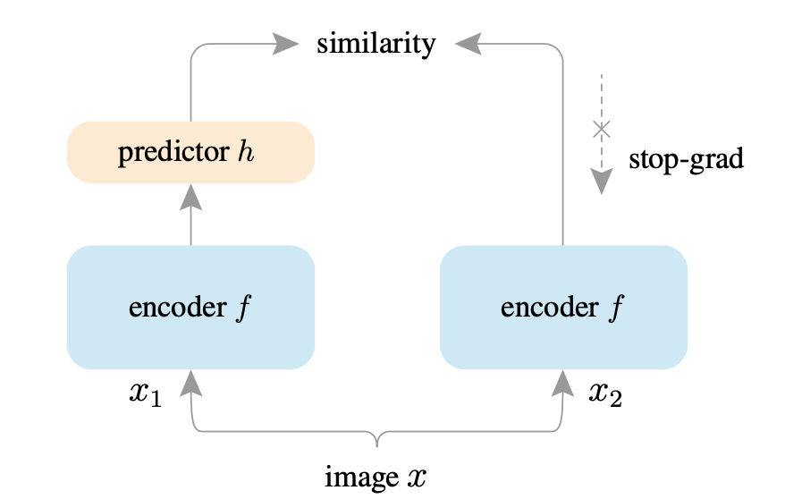

This code is inspired by the papers titled "Exploring Simple Siamese Representation Learning" (https://arxiv.org/abs/2011.10566) and "Pay Attention to MLPs" (https://arxiv.org/abs/2105.08050).

The main idea is to use a Neural Network architecture with gMLP layers as the backbone for SimSiam self-supervised learning replacing the ResNet backbone.

The network is trained with "CIFAR-10" dataset.

Fig.1 - SimSiam Architecture

